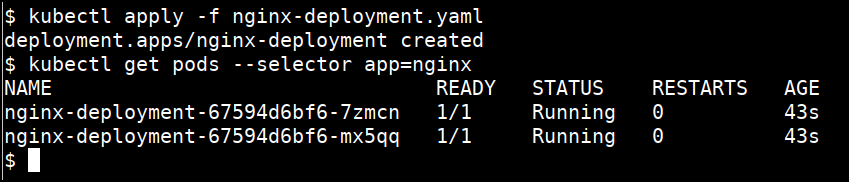
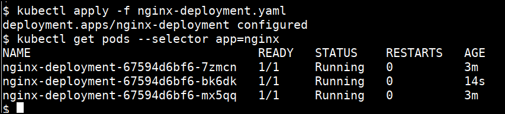
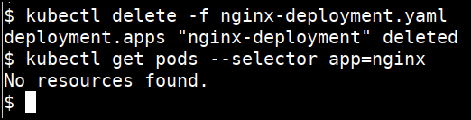

# Deploying simple application in Kubernetes Cluster using YAML

* To create a basic nginx deployment with 2 replicas, save this file as `nginx-deployment.yaml` using your text editor

```yaml
apiVersion: apps/v1
kind: Deployment
metadata:
  name: nginx-deployment
spec:
  selector:
    matchLabels:
      app: nginx
  replicas: 2
  template:
    metadata:
      labels:
        app: nginx
    spec:
      containers:
      - name: nginx
        image: nginx:1.7.9
        ports:
        - containerPort: 80
```

* Run the apply command to perform the changes in cluster

```bash
kubectl apply -f nginx-deployment.yaml
```

* Get the pods related to this deployment

```bash
kubectl get pods --selector app=nginx
```



* Update the deployment file with `replicas` to 3 in `nginx-deployment.yaml` using your text editor

```yaml
...
  replicas: 3
...
```

* Apply the changes

```bash
kubectl apply -f nginx-deployment.yaml
kubectl get pods --selector app=nginx
```



* Expose a service within the cluster
* Create a file `nginx-service.yml` with the following content

```yaml
apiVersion: v1
kind: Service
metadata:
  name: nginx-deployment
spec:
  ports:
  - port: 80
    protocol: TCP
    targetPort: 80
  selector:
    app: nginx
  type: ClusterIP
```

* Create the service in the cluster

```bash
kubectl apply -f nginx-service.yml
```

* Start a `port-foward` to access in-cluster service

```bash
kubectl port-forward svc/nginx-deployment 8888:80
```

* From another terminal, access the service through the port forward

```bash
curl http://localhost:8888/
```

* Delete the deployment

```bash
kubectl delete -f nginx-deployment.yaml
```



* Delete the service

```bash
kubectl delete -f nginx-service.yml
```

### References

* [https://kubernetes.io/docs/tasks/run-application/run-stateless-application-deployment/](https://kubernetes.io/docs/tasks/run-application/run-stateless-application-deployment/)
