# Hands-on common use-cases

## Getting started with `kubectl` CLI

`kubectl` is a command line interface for running commands against Kubernetes clusters. `kubectl` is pronounced as `cube c t l`. Watch this talk for [The definitive pronunciation guide](https://www.youtube.com/watch?v=2wgAIvXpJqU) :)

- Getting the kubernetes cluster information

```bash
kubectl cluster-info
```

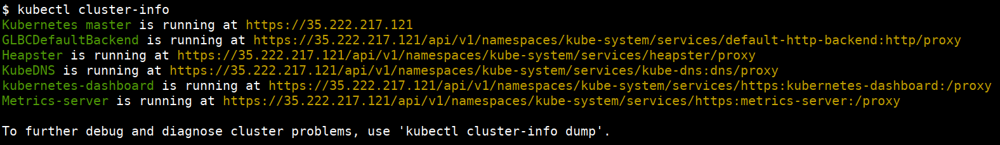

- Get information from nodes, pods, svc(services), ing(ingress), ns(namespace), deploy(deployments)

```bash
kubectl get nodes
kubectl get pods
```

```bash
kubectl get services
```

Bunch of these commands can use shortcuts. For example the rest of the commands are using their shortcuts.

```bash
kubectl get svc
kubectl get ing
kubectl get ns
kubectl get deploy
```

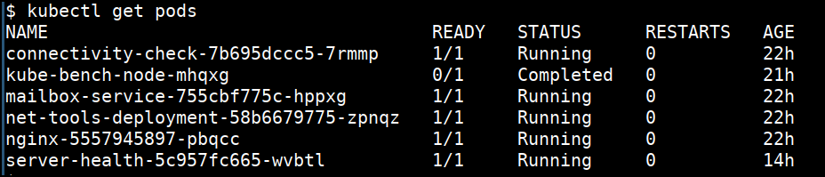

- Getting more information

```bash
kubectl get nodes -o wide
kubectl get pods -o wide
kubectl get svc -o wide
kubectl get deploy -o wide
```

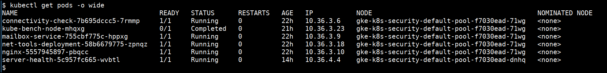

- Getting detailed information

```bash
kubectl describe node <NODENAME>
kubectl describe pod <PODNAME>
kubectl describe svc <SVCNAME>
kubectl describe ing <SVCNAME>
kubectl describe ns <SVCNAME>
kubectl describe deploy <DEPLOYNAME>
```

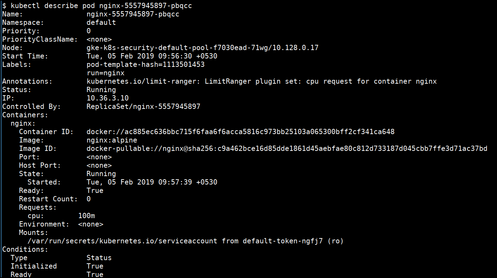

- Detailed help for the sub command

```bash
kubectl explain pod
```

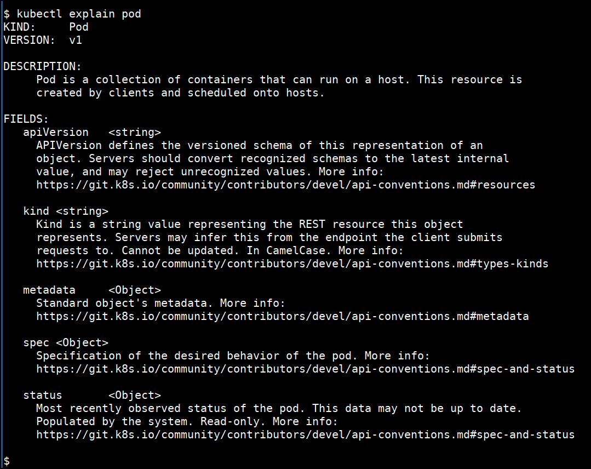

- Creating deployment using command line

```bash
kubectl run nginxdeployment --image=nginx:alpine
```

- Port forward the pod to local system

```bash
kubectl port-forward <PODNAME> 1234:80
```


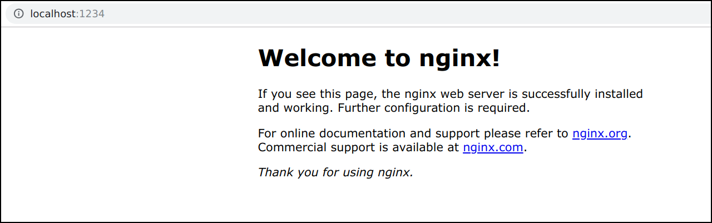

- Deleting pod

```bash
kubectl delete pod <PODNAME>
kubectl delete deploy <DEPLOYNAME>
kubectl delete svc <SVCNAME>
kubectl delete ing <INGNAME>
kubectl delete ns <NSNAME>
```

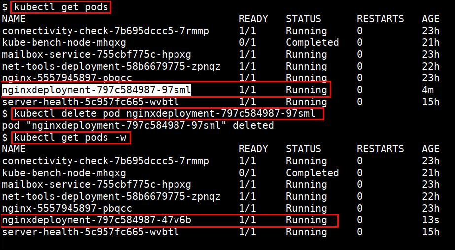

- Shell into the pod

```bash
kubectl exec -it <PODNAME> sh
```

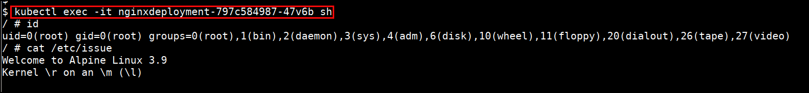

- Looking for logs (stdout & stderr)

```bash
kubectl logs <PODNAME>
kubectl logs -f <PODNAME>
```

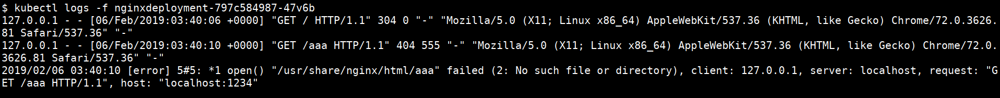

- Combining multiple commands

```bash
kubectl get pods,svc
```

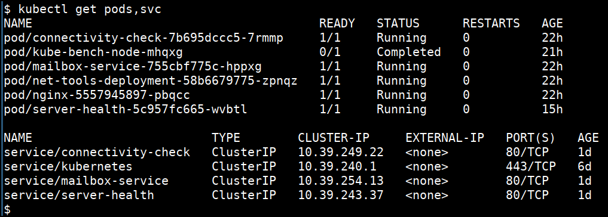

- Specifying with different namepsace

```bash
kubectl get pods -n database
```

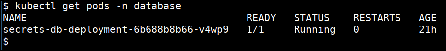

- Listing the API resources avialble

```bash
kubectl api-resources
```

- Checking for the permission to do

```bash
kubectl auth can-i create pods
```

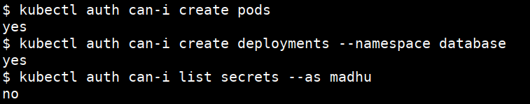

- Getting output in YAML format

```bash
kubectl get secrets <SECRETNAME> -o yaml
```

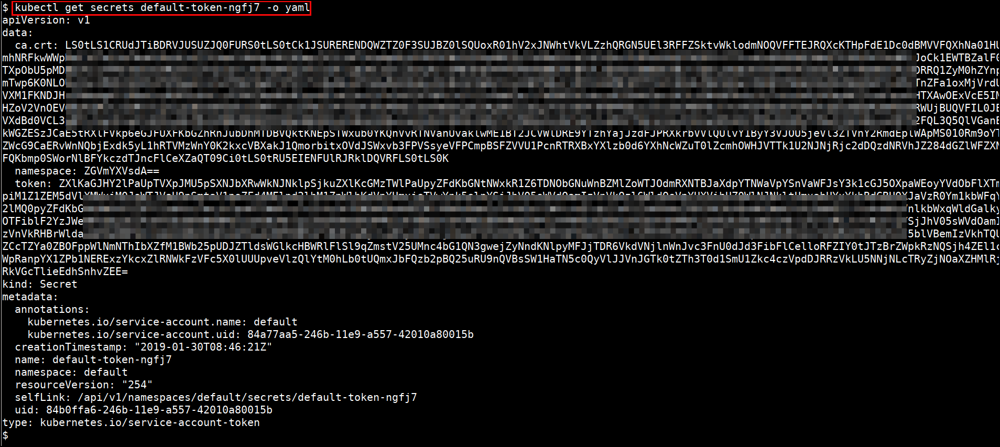

### References

- [kubectl Cheat Sheet](https://kubernetes.io/docs/reference/kubectl/cheatsheet/)
- [Kubernetes CheatSheets In A4](https://github.com/dennyzhang/cheatsheet-kubernetes-A4)

